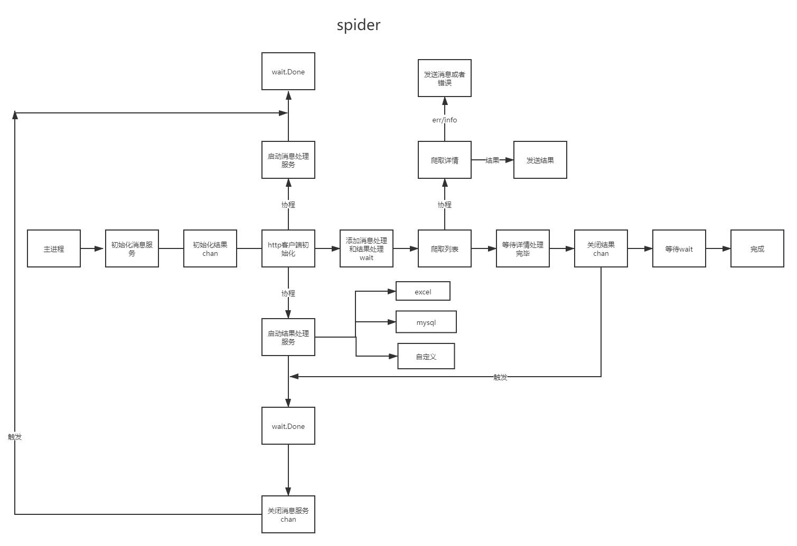

### article-spider是一个用go编写的爬取文章工具。支持两种模式，常规爬取模式和浏览器自动化模式

**安装**

```shell
go get github.com/PeterYangs/article-spider/v3
```

[v1版本](https://github.com/PeterYangs/article-spider/tree/v1)

**流程图**

流程图

**快速开始**

```go
package main

import (
	"github.com/PeterYangs/article-spider/v3/fileTypes"
	"github.com/PeterYangs/article-spider/v3/form"
	"github.com/PeterYangs/article-spider/v3/spider"
)

func main() {

	s := spider.NewSpider()

	s.LoadForm(form.CustomForm{
		Host:         "https://www.925g.com",
		Channel:      "/zixun_page[PAGE].html/",
		ListSelector: "body > div.ny-container.uk-background-default > div.wrap > div > div.commonLeftDiv.uk-float-left > div > div.bdDiv > div > ul > li",
		HrefSelector: " a",
		PageStart:    1,
		Length:       10,
		DetailFields: map[string]form.Field{
			"title": {ExcelHeader: "J", Types: fileTypes.Text, Selector: "body > div.ny-container.uk-background-default > div.wrap > div > div.commonLeftDiv.uk-float-left > div > div.articleDiv > div.hd > h1"},
			"img": {ExcelHeader: "H", Types: fileTypes.Image, Selector: "body > div.ny-container.uk-background-default > div.wrap > div > div.commonLeftDiv.uk-float-left > div > div.articleDiv > div.bd img:nth-child(1)", ImageDir: "app", ImagePrefix: func(form *form.Form, path string) string {

				return "app"
			}},
			"content": {ExcelHeader: "I", Types: fileTypes.HtmlWithImage, Selector: "body > div.ny-container.uk-background-default > div.wrap > div > div.commonLeftDiv.uk-float-left > div > div.articleDiv > div.bd", ImagePrefix: func(form *form.Form, path string) string {

				return "/api"
			}},
		},
		ListFields: map[string]form.Field{

			"desc": {ExcelHeader: "K", Types: fileTypes.Text, Selector: "  a > div > p"},
		},
		CustomExcelHeader:     true,
		DetailCoroutineNumber: 10,
	})

	s.Start()

}
```

**常用属性**

```
	Host                       string                                   //网站域名
	Channel                    string                                   //栏目链接，页码用[PAGE]替换
	PageStart                  int                                      //页码起始页
	Length                     int                                      //爬取页码长度
	ListSelector               string                                   //列表选择器
	HrefSelector               string                                   //a链接选择器，相对于列表选择器
	DisableAutoCoding          bool                                     //是否禁用自动转码
	LazyImageAttrName          string                                   //懒加载图片属性，默认为data-original
	DisableImageExtensionCheck bool                                     //禁用图片拓展名检查，禁用后所有图片拓展名强制为png,且跳过图片拓展检查
	AllowImageExtension        []string                                 //允许下载的图片拓展名
	DefaultImg                 func(form *Form, item Field) string      //图片出错时，设置默认图片
	DetailFields               map[string]Field                         //详情页面字段选择器
	ListFields                 map[string]Field                         //列表页面字段选择器,暂不支持api爬取
	CustomExcelHeader          bool                                     //自定义Excel表格头部
	DetailCoroutineNumber      int                                      //爬取详情页协程数(最大设置为30)
	HttpTimeout                time.Duration                            //请求超时时间
	HttpHeader                 map[string]string                        //header（支持cookie）
	HttpProxy                  string                                   //代理
	MiddleHrefSelector         []string                                 //中间层选择器(a链接选择器)，当详情页有多层时使用，暂不支持自动模式
	ResultCallback             func(item map[string]string, form *Form) //自定义获取爬取结果回调
	ApiConversion              func(html string, form *Form) []string   //api获取链接
	ChannelFunc                func(form *Form) []string                //自定义栏目链接
	NextSelector               string                                   //下一页选择器（用于自动化爬取）
	ListWaitSelector           string                                   //列表等待选择器（用于自动化爬取）
	DetailWaitSelector         string                                   //详情等待选择器（用于自动化爬取）
```

<br>

**设置header(包含cookie)**

```go
package main

import (
	"github.com/PeterYangs/article-spider/v3/fileTypes"
	"github.com/PeterYangs/article-spider/v3/form"
	"github.com/PeterYangs/article-spider/v3/spider"
)

func main() {

	s := spider.NewSpider()

	s.LoadForm(form.CustomForm{

		HttpHeader: map[string]string{
			"cookie":     "Hm_lvt_66246be1ec92d6574526bda37cf445cc=1633767654; Hm_lvt_56a5b64a8f7a92a018377c693e064bdf=1633767654; recente=%5B%7B%22vod_name%22%3A%22%E4%B8%80%E7%BA%A7%E6%8C%87%E6%8E%A7%22%2C%22vod_url%22%3A%22https%3A%2F%2Fwww.ahjingcheng.com%2Fplay%2F119516-1-1%2F%22%2C%22vod_part%22%3A%22%E6%AD%A3%E7%89%87%22%7D%2C%7B%22vod_name%22%3A%22%E5%85%BB%E8%80%81%E5%BA%84%E5%9B%AD%22%2C%22vod_url%22%3A%22https%3A%2F%2Fwww.ahjingcheng.com%2Fplay%2F119506-1-1%2F%22%2C%22vod_part%22%3A%221080P%22%7D%2C%7B%22vod_name%22%3A%22%E4%B8%96%E7%95%8C%E4%B8%8A%E6%9C%80%E7%BE%8E%E4%B8%BD%E7%9A%84%E6%88%91%E7%9A%84%E5%A5%B3%22%2C%22vod_url%22%3A%22https%3A%2F%2Fwww.ahjingcheng.com%2Fplay%2F59426-1-1%2F%22%2C%22vod_part%22%3A%22%E5%85%A8%E9%9B%86%22%7D%2C%7B%22vod_name%22%3A%22%E6%9C%BA%E6%A2%B0%E5%B8%882%EF%BC%9A%E5%A4%8D%E6%B4%BB%E8%8B%B1%E6%96%87%E7%89%88%22%2C%22vod_url%22%3A%22https%3A%2F%2Fwww.ahjingcheng.com%2Fplay%2F91322-1-1%2F%22%2C%22vod_part%22%3A%22%E9%AB%98%E6%B8%85%22%7D%5D; Hm_lvt_66246be1ec92d6574526bda37cf445cc=1633767654; Hm_lvt_56a5b64a8f7a92a018377c693e064bdf=1633767654; PHPSESSID=7sfu1ui3crco1a817vocccl2u1; Hm_lpvt_66246be1ec92d6574526bda37cf445cc=1633914645; Hm_lpvt_56a5b64a8f7a92a018377c693e064bdf=1633914645",
			"user-agent": "Mozilla/5.0 (Windows NT 10.0; Win64; x64) AppleWebKit/537.36 (KHTML, like Gecko) Chrome/92.0.4515.159 Safari/537.36",
		},
	})

	s.Start()

}
```

**自定义分页链接**

```go
package main

import (
	"github.com/PeterYangs/article-spider/v3/fileTypes"
	"github.com/PeterYangs/article-spider/v3/form"
	"github.com/PeterYangs/article-spider/v3/spider"
)

func main() {

	s := spider.NewSpider()

	s.LoadForm(form.CustomForm{
		Host: "https://www.925g.com",
		ChannelFunc: func(form *form.Form) []string {
			return []string{
				"https://www.925g.com/zixun_page1.html/",
				"https://www.925g.com/zixun_page2.html/",
				"https://www.925g.com/zixun_page3.html/",
				"https://www.925g.com/zixun_page4.html/",
				"https://www.925g.com/zixun_page5.html/",
				"https://www.925g.com/zixun_page6.html/",
				"https://www.925g.com/zixun_page7.html/",
				"https://www.925g.com/zixun_page8.html/",
				"https://www.925g.com/zixun_page9.html/",
			}
		},
		ListSelector: "body > div.ny-container.uk-background-default > div.wrap > div > div.commonLeftDiv.uk-float-left > div > div.bdDiv > div > ul > li",
		HrefSelector: " a",
		DetailFields: map[string]form.Field{
			"title": {ExcelHeader: "J", Types: fileTypes.Text, Selector: "body > div.ny-container.uk-background-default > div.wrap > div > div.commonLeftDiv.uk-float-left > div > div.articleDiv > div.hd > h1"},
			"img": {ExcelHeader: "H", Types: fileTypes.Image, Selector: "body > div.ny-container.uk-background-default > div.wrap > div > div.commonLeftDiv.uk-float-left > div > div.articleDiv > div.bd img:nth-child(1)", ImageDir: "app", ImagePrefix: func(form *form.Form, path string) string {

				return "app"
			}},
			"content": {ExcelHeader: "I", Types: fileTypes.HtmlWithImage, Selector: "body > div.ny-container.uk-background-default > div.wrap > div > div.commonLeftDiv.uk-float-left > div > div.articleDiv > div.bd", ImagePrefix: func(form *form.Form, path string) string {

				return "/api"
			}},
		},
		ListFields: map[string]form.Field{

			"desc": {ExcelHeader: "K", Types: fileTypes.Text, Selector: "  a > div > p"},
		},
		CustomExcelHeader:     true,
		DetailCoroutineNumber: 2,
	})

	s.Start()

}
```

**详情页中间层**

```go
package main

import (
	"github.com/PeterYangs/article-spider/v3/fileTypes"
	"github.com/PeterYangs/article-spider/v3/form"
	"github.com/PeterYangs/article-spider/v3/spider"
)

func main() {

	s := spider.NewSpider()

	s.LoadForm(form.CustomForm{
		Host:               "https://www.ahjingcheng.com",
		Channel:            "/show/dongzuo--------[PAGE]---/",
		ListSelector:       "body > div:nth-child(5) > div > div.col-lg-wide-75.col-xs-1.padding-0 > div:nth-child(2) > div > div.stui-pannel_bd > ul > li",
		HrefSelector:       " div > a",
		PageStart:          1,
		Length:             2,
		MiddleHrefSelector: []string{"body > div:nth-child(3) > div > div.col-lg-wide-75.col-xs-1.padding-0 > div:nth-child(1) > div > div:nth-child(2) > div.stui-content__thumb > a"},
		DetailFields: map[string]form.Field{
			"url": {Types: fileTypes.Regular, Selector: `"url":"([0-9A-Za-z/\\._:]+)","url_next"`, RegularIndex: 1},
		},

		//CustomExcelHeader:     true,
		DetailCoroutineNumber: 1,
		HttpHeader: map[string]string{
			"cookie":     "Hm_lvt_66246be1ec92d6574526bda37cf445cc=1633767654; Hm_lvt_56a5b64a8f7a92a018377c693e064bdf=1633767654; recente=%5B%7B%22vod_name%22%3A%22%E4%B8%80%E7%BA%A7%E6%8C%87%E6%8E%A7%22%2C%22vod_url%22%3A%22https%3A%2F%2Fwww.ahjingcheng.com%2Fplay%2F119516-1-1%2F%22%2C%22vod_part%22%3A%22%E6%AD%A3%E7%89%87%22%7D%2C%7B%22vod_name%22%3A%22%E5%85%BB%E8%80%81%E5%BA%84%E5%9B%AD%22%2C%22vod_url%22%3A%22https%3A%2F%2Fwww.ahjingcheng.com%2Fplay%2F119506-1-1%2F%22%2C%22vod_part%22%3A%221080P%22%7D%2C%7B%22vod_name%22%3A%22%E4%B8%96%E7%95%8C%E4%B8%8A%E6%9C%80%E7%BE%8E%E4%B8%BD%E7%9A%84%E6%88%91%E7%9A%84%E5%A5%B3%22%2C%22vod_url%22%3A%22https%3A%2F%2Fwww.ahjingcheng.com%2Fplay%2F59426-1-1%2F%22%2C%22vod_part%22%3A%22%E5%85%A8%E9%9B%86%22%7D%2C%7B%22vod_name%22%3A%22%E6%9C%BA%E6%A2%B0%E5%B8%882%EF%BC%9A%E5%A4%8D%E6%B4%BB%E8%8B%B1%E6%96%87%E7%89%88%22%2C%22vod_url%22%3A%22https%3A%2F%2Fwww.ahjingcheng.com%2Fplay%2F91322-1-1%2F%22%2C%22vod_part%22%3A%22%E9%AB%98%E6%B8%85%22%7D%5D; Hm_lvt_66246be1ec92d6574526bda37cf445cc=1633767654; Hm_lvt_56a5b64a8f7a92a018377c693e064bdf=1633767654; PHPSESSID=7sfu1ui3crco1a817vocccl2u1; Hm_lpvt_66246be1ec92d6574526bda37cf445cc=1633914645; Hm_lpvt_56a5b64a8f7a92a018377c693e064bdf=1633914645",
			"user-agent": "Mozilla/5.0 (Windows NT 10.0; Win64; x64) AppleWebKit/537.36 (KHTML, like Gecko) Chrome/92.0.4515.159 Safari/537.36",
		},
	})

	s.Start()

}
```

**自行处理爬取结果**

```go
package main

import (
	"fmt"
	"github.com/PeterYangs/article-spider/v3/fileTypes"
	"github.com/PeterYangs/article-spider/v3/form"
	"github.com/PeterYangs/article-spider/v3/spider"
)

func main() {

	s := spider.NewSpider()

	s.LoadForm(form.CustomForm{
		Host:         "https://www.925g.com",
		Channel:      "/zixun_page[PAGE].html/",
		ListSelector: "body > div.ny-container.uk-background-default > div.wrap > div > div.commonLeftDiv.uk-float-left > div > div.bdDiv > div > ul > li",
		HrefSelector: " a",
		PageStart:    1,
		Length:       10,
		ListFields: map[string]form.Field{

			"title": {ExcelHeader: "K", Types: fileTypes.Text, Selector: " a > div > span"},
		},
		CustomExcelHeader:     true,
		DetailCoroutineNumber: 2,
		ResultCallback: func(item map[string]string, form *form.Form) {

			for s2, s3 := range item {

				fmt.Println(s2, ":", s3)

			}

		},
	})

	s.Start()

}
```

**爬取列表是api的网页**

```go
package main

import (
	"encoding/json"
	"github.com/PeterYangs/article-spider/v3/fileTypes"
	"github.com/PeterYangs/article-spider/v3/form"
	"github.com/PeterYangs/article-spider/v3/spider"
)

func main() {

	s := spider.NewSpider()

	s.LoadForm(form.CustomForm{
		Host:      "http://www.tiyuxiu.com",
		Channel:   "/data/list_0_[PAGE].json?__t=16339338",
		PageStart: 1,
		Length:    10,
		DetailFields: map[string]form.Field{

			"title": {Types: fileTypes.Text, Selector: "h1"},
		},
		//CustomExcelHeader:     true,
		DetailCoroutineNumber: 2,
		ApiConversion: func(html string, form2 *form.Form) []string {

			type list struct {
				Url string
			}

			var l []list

			json.Unmarshal([]byte(html), &l)

			var temp []string

			for _, l2 := range l {

				temp = append(temp, l2.Url)

			}

			return temp
		},
	})

	s.StartApi()

}

```

**自动化模式**

```go
package main

import (
	"github.com/PeterYangs/article-spider/v3/fileTypes"
	"github.com/PeterYangs/article-spider/v3/form"
	"github.com/PeterYangs/article-spider/v3/spider"
)

func main() {

	s := spider.NewSpider()

	s.LoadForm(form.CustomForm{
		Host:         "https://www.925g.com",
		Channel:      "/zixun/",
		ListSelector: "body > div.ny-container.uk-background-default > div.wrap > div > div.commonLeftDiv.uk-float-left > div > div.bdDiv > div > ul > li",
		HrefSelector: "  a",
		//下一页选择器
		NextSelector: "body > div.ny-container.uk-background-default > div.wrap > div > div.commonLeftDiv.uk-float-left > div > div.bdDiv > ul > li:nth-child(11) > a",
		//列表等待选择器
		ListWaitSelector: "body > div.ny-container.uk-background-default > div.wrap > div > div.commonLeftDiv.uk-float-left > div > div.bdDiv > div > ul > li:nth-child(1)",
		//详情等待选择器
		DetailWaitSelector: "body > div.ny-container.uk-background-default > div.wrap > div > div.commonLeftDiv.uk-float-left > div > div.articleDiv > div.hd > h1",
		Length:             3,
		DetailFields: map[string]form.Field{
			"title": {ExcelHeader: "J", Types: fileTypes.Text, Selector: "body > div.ny-container.uk-background-default > div.wrap > div > div.commonLeftDiv.uk-float-left > div > div.articleDiv > div.hd > h1"},
			"img": {ExcelHeader: "H", Types: fileTypes.Image, Selector: "body > div.ny-container.uk-background-default > div.wrap > div > div.commonRightDiv.uk-float-right > div.single-sidebar > div > ul > li > a > img", ImageDir: "app", ImagePrefix: func(form *form.Form, path string) string {

				return "app"
			}},
		},
		ListFields: map[string]form.Field{
			"desc": {Types: fileTypes.Text, Selector: " a > div > p"},
		},
		//header
		HttpHeader: map[string]string{
			"cookie": "xx",
		},
	})

	s.StartAuto()

}
```

**自动化模式爬取加载更多页面**
```go
package main

import (
	"context"
	"github.com/PeterYangs/article-spider/v3/fileTypes"
	"github.com/PeterYangs/article-spider/v3/form"
	"github.com/PeterYangs/article-spider/v3/mode"
	"github.com/PeterYangs/article-spider/v3/spider"
	"github.com/chromedp/chromedp"
)

func main() {

	s := spider.NewSpider()

	s.LoadForm(form.CustomForm{
		Host:         "https://www.btcfans.com",
		Channel:      "/zh-cn/wallet",
		ListSelector: "body > div.page-width.page-content > div.main-content > div > div.module-content > ul > li",
		HrefSelector: " a",
		//下一页选择器
		NextSelector: "body > div.page-width.page-content > div.main-content > div > div.module-content > a",
		//列表等待选择器
		ListWaitSelector: "body > div.page-width.page-content > div.main-content > div > div.module-content > ul > li:nth-child(1)",
		//详情等待选择器
		DetailWaitSelector: "body > div.page-width.page-content > div.main-content > div.wallet-detail-page > div.info_1 > div.name > div.name-ch",
		Length:             4,
		DetailFields: map[string]form.Field{
			"title": {ExcelHeader: "G", Types: fileTypes.Text, Selector: "body > div.page-width.page-content > div.main-content > div.wallet-detail-page > div.info_1 > div.name > div.name-ch"},
			"content": {Types: fileTypes.HtmlWithImage, Selector: "body > div.page-width.page-content > div.main-content > div.wallet-detail-page > div.wallet-des > div > p", ExcelHeader: "E", ImagePrefix: func(form *form.Form, imageName string) string {

				return "/api/uploads"
			}, ImageDir: "game[date:md]/[random:1-100]"},
			"desc":    {Types: fileTypes.Attr, Selector: "meta[name=\"description\"]", AttrKey: "content", ExcelHeader: "H"},
			"keyword": {Types: fileTypes.Attr, Selector: "meta[name=\"keywords\"]", AttrKey: "content", ExcelHeader: "K"},
			"img":     {Types: fileTypes.Image, Selector: "body > div.page-width.page-content > div.main-content > div.wallet-detail-page > div.info_1 > div.cover > img", ExcelHeader: "F", ImageDir: "game[date:md]/[random:1-100]"},
			"type":    {Types: fileTypes.Fixed, Selector: "2", ExcelHeader: "L"},
			//"size":    {Types: fileTypes.SingleField, Selector: "#dinfo > p.base > i:nth-child(3)", ExcelHeader: "M"},
		},
		
		//cookie
		HttpHeader: map[string]string{
			"user-agent": "Mozilla/5.0 (Windows NT 10.0; Win64; x64) AppleWebKit/537.36 (KHTML, like Gecko) Chrome/92.0.4515.159 Safari/537.36",
			"cookie":     "lang=zh-CN; lang=zh-CN; lang=zh-CN; _ga=GA1.1.1532009431.1641283813; UM_distinctid=17e24238a22739-0fc0995e9cfdad-c343365-1fa400-17e24238a2352e; guid=cff3a072d6ca30b80ee729f0884a8596f65d9a28; CNZZDATA5291371=cnzz_eid%3D1358048227-1641278212-%26ntime%3D1641338428; CNZZDATA1278599438=848177868-1641279863-%7C1641340242; Hm_lvt_ddaa34551214df42d1e5f11974f9f744=1641283822,1641346329; _csrf=3f62bc78510faa5fecfbf404cbee0ec56d1c4f3a; s_a=1; _ga_76F07DJEB4=GS1.1.1641346328.3.1.1641346978.0; Hm_lpvt_ddaa34551214df42d1e5f11974f9f744=1641346980",
		},
		NextPageMode:      mode.LoadMore,
		CustomExcelHeader: true,
		AutoPrefixEvent: func(chromedpCtx context.Context) {

			chromedp.Run(
				chromedpCtx,

				chromedp.Click("#Alert > div > div.sure_btn", chromedp.ByQuery),
			)

		},
	})

	s.StartAuto()

}
```

**代理**

```go
package main

import (
	"github.com/PeterYangs/article-spider/v3/fileTypes"
	"github.com/PeterYangs/article-spider/v3/form"
	"github.com/PeterYangs/article-spider/v3/spider"
)

func main() {

	s := spider.NewSpider()
	s.LoadForm(form.CustomForm{
		Host:         "https://www.cgcosplay.jp",
		Channel:      "/product-list?page=[PAGE]",
		ListSelector: "#inner_main_container > section > div > div.page_contents.clearfix.alllist_contents > div > div.itemlist_box.tiled_list_box.layout_photo > div > ul > li",
		HrefSelector: " div > a",
		PageStart:    1,
		Length:       10,
		ListFields: map[string]form.Field{
			"title": {ExcelHeader: "A", Types: fileTypes.Text, Selector: "div > a > div > div.list_item_data > p.item_name > span.goods_name"},
			"price": {ExcelHeader: "B", Types: fileTypes.Text, Selector: "div > a > div > div.list_item_data > div > div > p.selling_price > span.figure"},
			"img": {ExcelHeader: "C", Types: fileTypes.Image, Selector: "  div > a > div > div.list_item_photo > div > div", ImageDir: "cgcosplay_image", ImagePrefix: func(form *form.Form, path string) string {

				return "cgcosplay_image"
			}},
		},
		CustomExcelHeader:     true,
		DetailCoroutineNumber: 10,
		LazyImageAttrName:     "data-src",
		HttpProxy:             "http://127.0.0.1:4780",
	})

	s.Start()

}
```

**debug**

```go
s := spider.NewSpider()

s.SetDebug(true)
```
